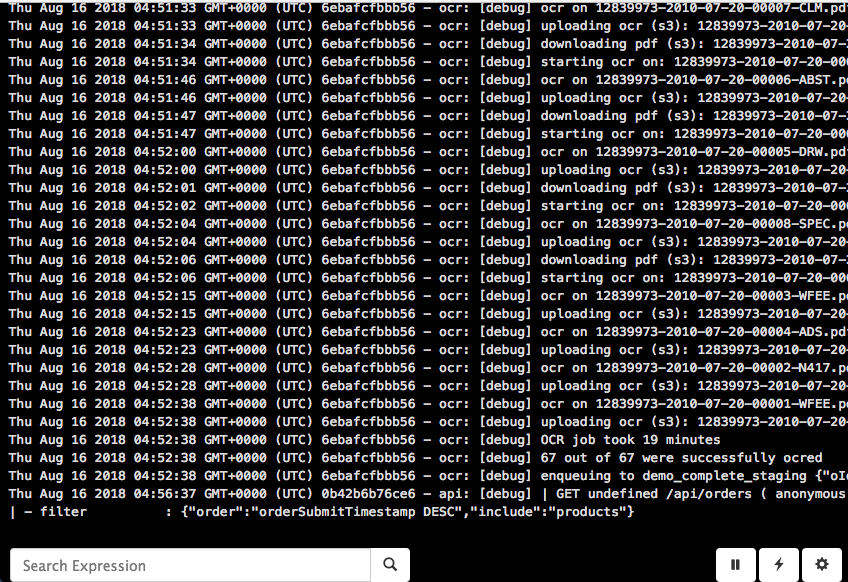

# Logregator

1. I want to get my logs off of my containers and centralize them somewhere.
2. I want to set up search expressions that if met, will send an email to some people.
3. I want a "tail -f" web gui for these logs.
4. I still want to be able to get at physical ascii log files to grep, sed, awk, etc.
5. I never want to run out of disk space due to logging.  I want my physical logs to be rotated and compressed and thrown away when they get old.

This thing runs as a `graylog2` server (on port 12201/udp by default) and also runs a web server on port 8080 (by default).  
Clients can write logs via GELF protocol (I use [winston-gelf-pro](https://github.com/peebles/winston-gelf-pro)) and users can view the logs in realtime via the
web server.

This server only supports GELF over UDP.



## Quick Start

Create a file called "./env.txt" that looks something like this:

```sh
# Basic Authentication for the web page
WEBSERVER_USER=admin
WEBSERVER_PASS=password

# logrotate variables
LOGS_MAXSIZE=104857600
LOGS_MAXFILES=3

# Email stuff
EMAIL_TRANSPORT=smtp
EMAIL_FROM=events@newco.com

# smtp
SMTP_USER=<yours>
SMTP_PASS=<yours>
SMTP_HOST=<yours>
SMTP_PORT=465
SMTP_AUTH=PLAIN
```

Then launch the container:

```sh
docker-compose up -d
```

## Backups

Wanna back up your logs to S3?  Consider [this](https://github.com/peebles/docker-backup-to-s3).  Just mount the volume "logdata"
into "/data" on that container.

## Server Configuration

See "./config.json" for the configuration that is possible.  Most of it involves configuring email to get notifications
of events when they occur.

## Client Configuration

I recommend [winston-gelf-pro](https://github.com/peebles/winston-gelf-pro) which is a pretty thin winston transport wrapper around [gelf-pro](https://github.com/kkamkou/node-gelf-pro).  The following configuration
code will work nicely, giving you nicely formatted errors and exceptions.  It will also communicate the `program` by using the package name in "package.json".  And it
will include the NODE_ENV value in the metadata for every message.

**NOTE** As of this writing, I also recommend winston 2.x.  winston-gelf-pro will work with winston 3.x, but winston 3.x is still a little green around the
ears and has some compatibility issues.  So ...

```sh
npm install --save winston@2
npm install --save winston-gelf-pro
```

```javascript
const winston = require( 'winston' );
const package = require( './package.json' );
require( 'winston-gelf-pro' );

let transports = [];

transports.push(
  new winston.transports.Console({
    handleExceptions: true,
    humanReadableUnhandledException: true,
    colorize: true,
    timestamp: true,
    prettyPrint: function( meta ) {
      if ( meta && meta.trace && meta.stack && meta.stack.length ) {
        if ( Array.isArray( meta.stack ) )
          return "\n" + meta.stack.slice(1).join( "\n" );
        else
          return "\n" + meta.stack;
      }
      else if ( meta && meta.message && meta.stack ) {
        return meta.stack;
      }
      return JSON.stringify( meta );
    },

  })
);

transports.push(
  new winston.transports.GelfPro({
    level: 'debug',
    handleExceptions: true,
    humanReadableUnhandledException: true,
    gelfPro: {
      fields: {
        env: process.env.NODE_ENV || 'development',
        program: package.name,
      },
      transform: [
        function(m) {
          if ( m.process && m.os && m.trace && m.stack ) {
            // This is an uncaught exception.  Format it so it shows up
            // in logregator nicer.
            m.short_message = m.stack.join('\n');
            delete m.date;
            delete m.process;
            delete m.os;
            delete m.trace;
            delete m.stack;
          }
          return m;
        }
      ],
      adapterName: 'udp',
      adapterOptions: {
        protocol: 'udp4',
        host: '192.168.99.100',
        port: 12201
      }
    }
  })
);

log = new (winston.Logger)({
  transports: transports
});

// test...
log.info( 'here we go', 'again' );
log.info( 'here we go', {"foo":"bar"} );
log.debug( 'This is a debug message' );
log.warn( 'This is a warning' );
log.error( 'error:', new Error( 'MyError Message' ) );
log.error( new Error( 'GENERATED' ) );

// uncaught exception handling
let foo = bar;

```

## Access to Raw Files

```sh
docker exec -it logs ls -l
docker exec -it logs cat all.log
docker cp logs:/data/all.log /tmp
docker exec -it logs bash
```

## Web UX

Hopefully the UX is mostly self evident, except for:

### Lucene Exressions

Basically, the syslog messages are being parsed into JSON and internally look like this:

```javascript
{
  timestamp: "THE TIMESTAMP",
  program:   "THE PROGRAM NAME OF THE SENDER",
  host:      "THE HOSTNAME OF THE SENDER",
  level:     "SEVERITY: error, info, debug, warn, etc",
  message:   "THE MESSAGE",
  meta:      "ANY METADATA SENT WITH THE MESSAGE"
}
```

These fields are searchable in the UX using a [Lucene](https://github.com/peebles/json-lucene-like-query) syntax.  This
is very similar to how you'd search for things in Elastic Search if you've ever used that tool.  Just type your lucene 
expression in the search field to filter the messages shown.  Then you can click on the `Save Event` button to create an
event based on that search expression and send emails to people when that event occurs.


